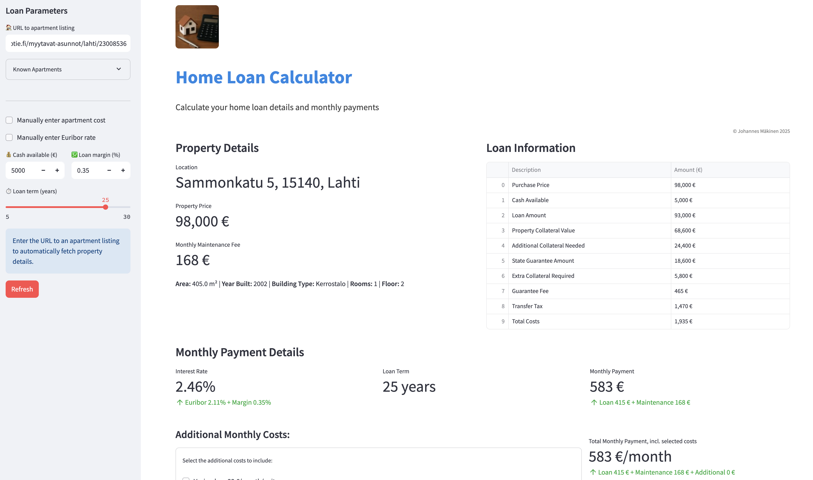

# How it works
1. Input an Oikotie link to an apartment
2. The app will scrape the information of the apartment
3. The app will calculate loan information based on the scraped data and valtionkonttori specifications
    - You can also input your own values for the loan amount, interest rate, loan duration and available funds.
4. The app will display the results in a table and a graph 

